# 🧮 Hidden Markov Models in Quantitative Finance  
> “Behind every observed price or transaction lies a hidden regime.” 

## 📘 Overview

This repository is a **hands-on tutorial** and **conceptual roadmap** for understanding and applying **Hidden Markov Models (HMMs)** in **Quantitative Finance and Fund Flow Analysis**.

It bridges **probabilistic modeling theory** with **real-world financial applications**, including **regime detection**, **fund trail analysis**, and **anomaly detection** in temporal transaction data.

<!-- Inspired by *Vittiya Anveshak* — a probabilistic fund-trail analysis system using HMMs — this repo is meant for postgraduate students, quantitative researchers, and data scientists exploring **AI for Finance**. -->

## 🧭 Roadmap at a Glance

```mermaid
flowchart TD
    A[📚 Foundations of HMMs] --> B[🔢 Mathematical Formulation]
    B --> C[🧩 State Inference & Decoding]
    C --> D[💹 Financial Applications]
    D --> E[🚨 Anomaly Detection]
    E --> F[📈 Regime Modeling & Forecasting]
    F --> G[🤖 Hybrid & Advanced HMMs]
```

Each module combines theory + code + intuition, with a focus on financial signal interpretation.

---

## 🧠 1. Conceptual Foundations

### 🔍 What is an HMM?

An **HMM** models **systems with unobservable states** influencing observable outcomes — ideal for financial systems where market or behavioral states are hidden.

| Component | Description | Example in Finance |
|------------|-------------|--------------------|
| Hidden States | Latent regimes | Bull / Bear market |
| Observations | Measurable variables | Price returns, transaction volume |
| Transition Probabilities | State switching likelihood | Market moving from calm → volatile |
| Emission Probabilities | Observable likelihood given state | Probability of a return given regime |

Mathematically:

$$
P(O, S) = P(S_1) \prod_{t=2}^{T} P(S_t|S_{t-1}) \prod_{t=1}^{T} P(O_t|S_t)
$$

## 🧩 2. Mathematical & Algorithmic Core

### 🧮 Algorithms Covered
- **Forward-Backward Algorithm** → Probability of observed sequence  
- **Viterbi Decoding** → Most likely hidden state sequence  
- **Baum-Welch (EM)** → Learning parameters from data  

📘 *Notebook:* `01_HMM_Fundamentals.ipynb`  
> Step-by-step implementation of HMM inference & training with synthetic data.

## 💰 3. Applications in Finance
### 🧱 (A) Market Regime Detection

Identify **bull/bear** or **high/low volatility** phases using HMMs.

- Input: Returns or volatility time series  
- Output: Hidden market regimes  
- Extension: Markov-Switching Models (MSM), Hidden Semi-Markov Models (HSMM)

📊 *Notebook:* `02_Regime_Detection_HMM.ipynb`

### 🔎 (B) Fund Flow & Anomaly Detection *(Vittiya Anveshak)*

Model **fund transfers as temporal sequences**, capturing **hidden behavioral states** and **transaction irregularities**.

- HMM learns normal fund flow patterns  
- Detects anomalous transitions or emission probabilities  
- Synthetic data generated via **CTGAN** for training diversity  

📘 *Notebook:* `03_Fund_Trail_Analysis_HMM.ipynb`

> 💡 *This mirrors approaches used in AML (Anti-Money Laundering) and FinTech compliance analytics.*

### 📈 (C) Quantitative Forecasting

Integrate HMMs with autoregressive structures to model **returns, spreads, and volatility clusters**.

- Markov Switching AR / GARCH models  
- Volatility regime modeling  
- Risk-adjusted strategy simulation  

📘 *Notebook:* `04_Regime_Switching_Forecasting.ipynb`

## 🧬 4. Advanced Extensions

### 🧠 Hybrid and Hierarchical Models

| Model Type | Description | Financial Use |
|-------------|--------------|---------------|
| **Hierarchical HMMs (HHMMs)** | Multi-level latent structures | Multi-market or sector-based modeling |
| **Bayesian HMMs** | Parameter uncertainty handling | Risk quantification |
| **HMM + Deep Models (RNN, Transformer)** | Learn emissions or transitions | Adaptive regime modeling |
| **Graph-HMMs** | Transaction network inference | Fraud and fund-flow networks |

📘 *Notebook:* `05_Advanced_HMMs.ipynb`

## 🧰 5. Implementation Tools

| Library | Usage |
|----------|-------|
| `hmmlearn` | Core HMMs (Gaussian, Multinomial) |
| `pomegranate` | Probabilistic graphical model support |
| `pyHSMM` | Hidden Semi-Markov Models |
| `ctgan` | Synthetic financial data generation |
| `networkx`, `pandas`, `matplotlib` | Data handling & visualization |

## 🎓 6. Learning Objectives

By the end of this tutorial, you will:
- Understand **probabilistic state modeling** for temporal data  
- Implement **HMMs from scratch** and interpret hidden financial regimes  
- Apply HMMs to **fund trail analysis**, **fraud detection**, and **regime switching**  
- Extend classical HMMs using **deep learning** and **Bayesian inference**

## 🎨 Visual Intuition

---
## 🚀 Next Steps

- Extend to **Hierarchical / Semi-Markov Models**
- Add **Bayesian inference for uncertainty estimation**
- Integrate with **Reinforcement Learning** for **adaptive trading**
- Deploy as a **probabilistic fund-tracking dashboard**

## 🏦 Real-World Relevance

| Level | Focus | Financial Context |
|--------|--------|------------------|
| **Basic HMM** | Sequence modeling | Fund irregularities, AML |
| **HSMM / Regime-Switching** | Latent state transitions | Market regimes |
| **HMM + Bayesian / RL / Deep** | Adaptive decision-making | Quant trading, meta-learning |
| **Graphical HMMs** | Network dependency modeling | Transaction ecosystems |

## ✍️ Acknowledgment

This repository concept draws inspiration from:

- **Vittiya Anveshak** — Fund Trail Analysis via HMMs and CTGAN  
- **Quantitative ML Research Labs** — JP Morgan, Citadel, Two Sigma  
- **Academic sources** — Rabiner (1989), Murphy (2012), Shumway & Stoffer (2017)

## 🧑‍🏫 Author

### Agasthya  
Researcher in Quantitative Systems, Probabilistic Modeling, and Financial Machine Learning

## 📜 License

MIT License — freely available for educational and research use.